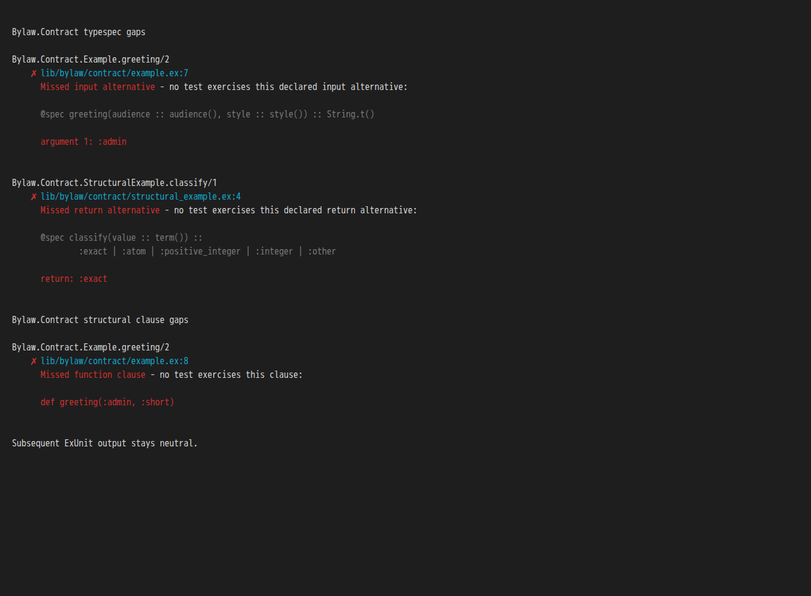
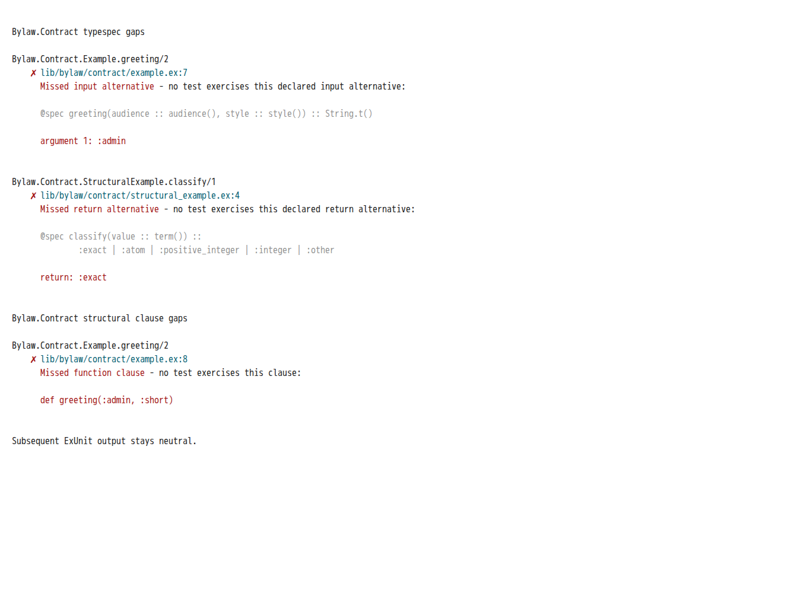

# Diagnostic color validation — 2026-09-05

Bead: `bylaw-contract-validate-colors-in-sprite`. This validates the diagnostic
colors merged in [PR #282](https://github.com/ryanzidago/bylaw/pull/282), commit
`25e0e8a6393865cb9b920df3bd203eb984b6d938`. The original uncolored renderer is
from `056be539ae3c45b1872b1b148cb519396aa919ca`.

Development and external QA ran through Sprite CLI in the session-owned
`bylaw-contract-colors` environment and a dedicated Worktrunk worktree.
Runtime: Elixir 1.20.2 / OTP 29.0.3, Ubuntu 26.04, eight schedulers. Final source
files were transferred to the local task worktree with length and SHA-256
verification before Git operations. The landed rendering implementation and
public API are retained; the option typespec now lists its supported key/value.

## Additional acceptance coverage

Existing color acceptance tests invoke formatter callbacks directly. Five new
fresh-VM tests run the actual ExUnit runner against independently compiled
fixture modules. They verify explicit forcing/disabling against the opposite
runtime setting, runtime defaults, escape-free summary output, and silent
fully exercised targets. A sixth test verifies that incomplete observations
remain plain and do not become coverage gaps when colors are forced.

These scenarios were inventoried and implemented during the original Sprite
work; after PR #282 landed independently, the six additional cases passed
against that implementation. They are integration/preservation evidence,
not claims of a newly failing behavioral regression. The duplicate renderer
implementation and overlapping direct color tests were not retained.

## Preferred-project QA

Each repository used its pinned source and a dedicated linked worktree. The
only tracked consumer change was a test path dependency on the candidate
package. Upstream tests, exclusions and normal concurrency were preserved.
These are the complete default ExUnit suites, not database adapter integration
suites or every optional upstream suite. Each ran with both color flags:

```sh
mix test --seed 922331 --no-color \
  --formatter ExUnit.CLIFormatter --formatter Bylaw.Contract.ExUnitFormatter
mix test --seed 922331 --color \
  --formatter ExUnit.CLIFormatter --formatter Bylaw.Contract.ExUnitFormatter
```

| Repository | Revision | Both full-suite runs | Observation / color result |
| --- | --- | --- | --- |
| Ecto | `11784f821a1bb0eedeee59583e311d836cb39ee1` | 1,591 passed | Incomplete at the existing 4,096-message queue threshold; diagnostic remains plain in both modes |
| Phoenix | `1e6183e9ebab9994cf6e43d3af445f32664cc10c` | 1,086/1,087 passed in each mode, 33 excluded | Complete; correct plain/styled output; distinct WebSocket timing failures retained |
| FLAME | `2b124f3ffdede8c1f125ce36b237bef1c50940a3` | 59/62 without colors, 60/62 with colors | Complete; correct plain/styled output; code-sync and one additional timing failure retained |

Ecto's full runs overflowed Typespec/FunctionClauses at 4,251/4,360 and
5,409/4,124 respectively. A whole `uuid_test.exs` probe also overflowed.
These remain incomplete results, not evidence of complete test coverage.
A supplementary run selecting the existing `test/ecto/uuid_test.exs:13` cast
test passed in both modes with complete observations and actionable reports;
ANSI was present only for `--color`. No queue limit or test body was changed.
The initial independent candidate also passed both full suites with incomplete
observations; its two Phoenix runs passed 1,087 tests each. That earlier evidence
is retained separately and is not substituted for the final-base runs above.
The throughput limitation remains tracked by
`bylaw-contract-recover-complete-qa-observation`.

The full runs above overlapped repository compilation and are not timing
comparisons. Phoenix missed a 400ms WebSocket shutdown notification, with a
Cowboy quiet-client case in color-off and a Bandit disconnect-broadcast case
in color-on. The failure is tracked as
`bylaw-qa-phoenix-websocket-timeout`; no load or library causality is inferred.

FLAME failed `CodeSyncTest` at `test/code_sync_test.exs:101` and `RunnerTest`
at `test/runner_test.exs:257`. Its color-off run also failed the 100ms
`FLAME.FLAMETest` call-links assertion. An earlier full run with only
`ExUnit.CLIFormatter`, hence no observer, reproduced the two code-sync failures
(60/62 passed). This does not establish their root cause. Follow-up:
`bylaw-qa-flame-code-sync-worktree-failures`.

After the competing build stopped, the same default suites were repeated
serially with observation disabled, colors off and colors on:

| Repository | Observer disabled | Colors off | Colors on |
| --- | ---: | ---: | ---: |
| Phoenix | 1,087 passed, 33 excluded | 1,087 passed, 33 excluded | 1,087 passed, 33 excluded |
| FLAME | 60/62 passed | 59/62 passed | 60/62 passed |

Both instrumented modes produced complete observations and the expected color
behavior. Phoenix's earlier failures did not recur; this does not establish
load causality. FLAME retained both code-sync failures in every mode. Its
plain run additionally exited `killed` in `FLAME.RunnerTest`'s
`execution timeout single use` at `test/runner_test.exs:178`. That differs from
the earlier call-links timeout; both remain recorded in the FLAME follow-up.
No upstream timeouts, tests or concurrency settings were changed.

## Exact rendering comparisons

Zero-call snapshots from all application modules exercise realistic source,
location, label and wrapping data. They validate rendering only; they are not
claims about upstream test coverage. For the same immutable snapshot, candidate
plain text and ANSI-stripped colored text both equal the original renderer's
output byte for byte. No plain output contains added ANSI escapes.

| Application | Modules | Findings compared | Plain bytes |
| --- | ---: | ---: | ---: |
| Ecto | 102 | 3,740 | 809,543 |
| Phoenix | 92 | 1,751 | 370,689 |
| FLAME | 31 | 210 | 39,981 |

Total: **5,701 findings**. Reproduce with
[compare-colored-output.exs](compare-colored-output.exs), from each prepared
consumer checkout using the candidate dependency:

```sh
# Export the original renderer from the Bylaw checkout first.
git show 056be539:packages/bylaw_contract/lib/bylaw/contract/report.ex > /tmp/baseline-report.ex
# Then run from a prepared consumer checkout; substitute its OTP application.
MIX_ENV=test BYLAW_COLOR_APP=ecto BYLAW_COLOR_OUTPUT=/tmp/ecto-colors \
  BYLAW_COLOR_BASELINE=/tmp/baseline-report.ex \
  mix run /path/to/bylaw/packages/bylaw_contract/qa/compare-colored-output.exs
```

## Terminal review and retained evidence

These are actual ANSI reports rendered in xterm.js 6.0.0 with light and dark terminal
palettes. Visual review verified legible hierarchy, preserved spacing and
multiline specs, and neutral text after the report. Terminal palettes determine
the exact shades. No browser or terminal dependency was added to Bylaw.





Final logs, snapshot text and results are retained on the Sprite under
`/tmp/bylaw-color-qa-landed`; the initial independent candidate evidence remains
separate in `/tmp/bylaw-color-qa`. Idle repeats are in `/tmp/bylaw-color-qa-idle`;
visual generation files are in `/tmp/bylaw-color-visual`.
The remote gate log is `/tmp/bylaw-colors-final-remote-qa.log`. Its Elixir
stages and UI formatting/build/typecheck completed, but browser tests reached
5000ms timeouts with leaked contexts. The run was deliberately stopped after
14 failures; it is not a successful remote whole-gate result. The unchanged
first failing browser file then passed 12 tests in isolation, with the same
toolchain and timeout. A final whole-gate repeat, after the external runs had
finished, again completed all Elixir stages and UI formatting/build/typecheck.
The same browser file then produced six 5000ms timeout failures. That repeat
was deliberately stopped with SIGTERM (exit 143); its log is
`/tmp/bylaw-colors-final-remote-qa-repeat.log`. No remote whole-gate pass is
claimed. Follow-up: `bylaw-ui-sprite-browser-timeouts`.
The automatic update hook picked up the Sprite bundled Elixir 1.19 toolchain;
it was stopped and the gate rerun explicitly through `mise exec` on the
repository-pinned runtime.
The obsolete original-candidate gate was deliberately stopped when PR #282
landed; its partial log is not used as final validation.

Separate findings were filed as `bylaw-sprite-exec-truncates-large-stdout`
(exit-zero stdout truncation at 65,536 bytes; chunked, checksum-verified transfer
worked) and `bylaw-contract-avoid-elixir-119-helper-warnings` (pre-existing
undefined compiler-helper warnings on Elixir 1.19.2 / OTP 28.1). The compiler-helper issue was subsequently addressed independently by raising
the package requirement to Elixir 1.20; this evidence was gathered before that
change. The output-transfer issue remains separate from diagnostic rendering.

## Local release validation

The mirrored source and binary previews match the Sprite files by SHA-256.
All 164 package tests pass on the tested base `25e0e8a6`, including the six
additional tests. The final local `scripts/qa.sh` passed every stage, including
974 UI tests; log: `/tmp/bylaw-colors-final-local-qa.log`. Remote full-gate
limitations above remain visible despite this successful local gate.

## Preview in a terminal

From this package directory, render gaps in the built-in example with the
actual reporting API:

```sh
MIX_ENV=test mise exec -- mix run -e '
alias Bylaw.Contract
{:ok, tracer} = Contract.start([Bylaw.Contract.Example])
Contract.stop(tracer) |> Contract.print_report(:stdio, colors: true)
'
```

Change `colors: true` to `colors: false` for a plain comparison. The preview
uses the caller's terminal palette and intentionally makes no calls to the
example, so its unexercised alternatives and clauses are visible.
